# Invite The Bot
Tulpje can be invited to your server using the following link: [Add To Discord](https://discord.com/oauth2/authorize?client_id=1220754275530051605)

# Permissions
What permissions the bot requests and why

* **View Channels:** required to do anything with channels
* **Manage Channels:** needed to set up fronter category and notification channel
* **Manage Roles:** needed to set up member roles
* **Create/Manage Expressions:** needed to create emojis
* **Send Messages:** bot responses and front change notifications
* **Read Message History:** used to track emoji usage in messages
* **Embed Links:** some of the bot's responses are considered embed links

# Commands

## Emojis

### /emoji stats
Shows the usage stats of your servers emojis in the server

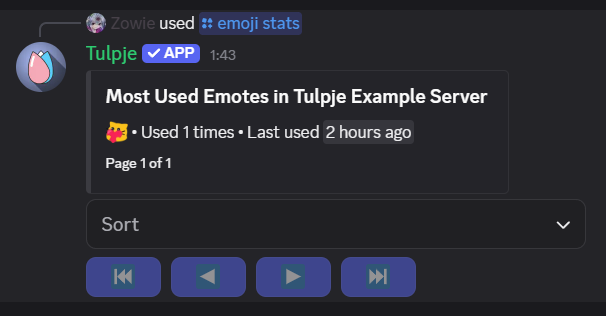

### /emoji maintenance
Cleans up any emoji you have since deleted from your server.
Under normal circumstances you shouldn't have to run this

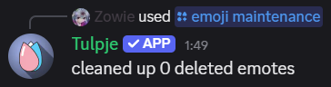

### /emoji clone
Copy the specified emojis to this server

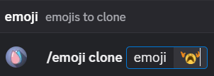

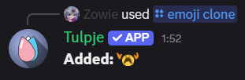

## PluralKit
To make use of any of the [PluralKit](https://pluralkit.me/) modules you have to
set it up first using `/pk setup`

### /pk setup
Configures the bot for use with your PluralKit system

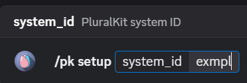

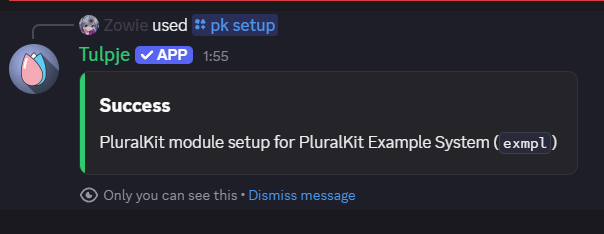

### Fronter Category
Set up a category in the current server that displays the fronters for the
system specified in `/pk setup`

#### /pk fronters setup
Creates a category in your server that'll contain the list of fronters

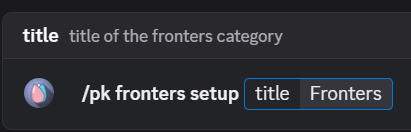

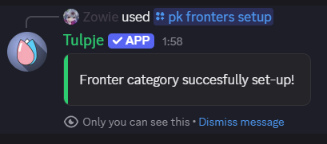

After running the command you should now have a new category:

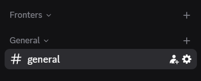

#### /pk fronters update
Manually updates the list of fronters in your server, in case automatic updates aren't working

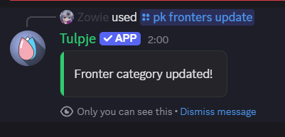

After updating your fronters should be listed under category:

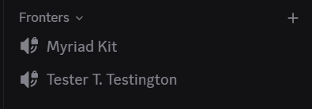

#### Front Notifications
Allows you to follow systems and have notifications sent in a channel in the current
server whenever a system's fronters change

Here's an example notification:

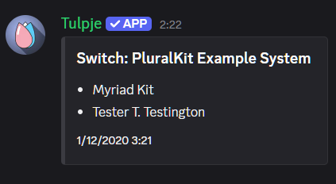

#### /pk notify setup
Configure a channel to receive switch notifications in

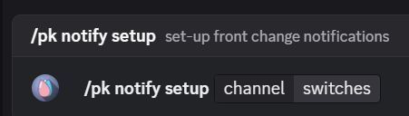

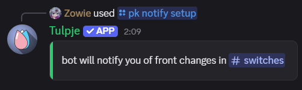

#### /pk notify list
List the systems you're currently receiving switch notifications for

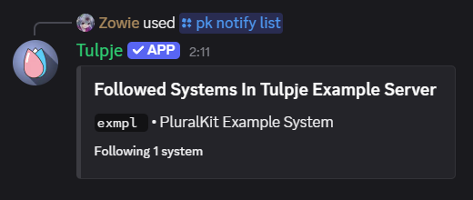

#### /pk notify add
Add a system to receive switch notifications for

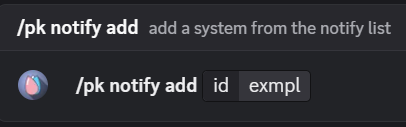

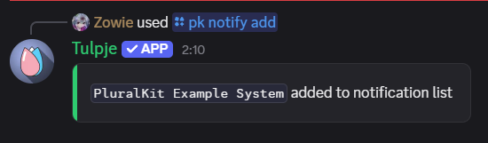

#### /pk notify remove
Remove a system you no longer wanna receive switch notifications for

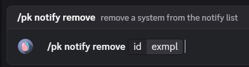

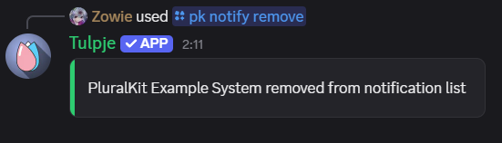

### System Member Roles
Creates a role for each system member in this server, and assigns them to the user
that ran `/pk setup` to allow mentioning individual system members

#### /pk roles update
Creates roles in the discord for each individual member of your system.
All of these will be assigned to you so individual members can be mentioned.
*You can optionally specify your PluralKit token to also add private members.*

> **⚠️ Warning ⚠️** 
> Currently there's no way to delete the created roles
> so if you end up disliking them it might take some effort to remove them

You'll get a summary after updating roles completes

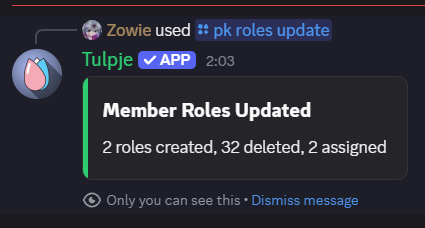

Others in the server can then mention the system member

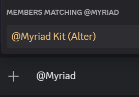

And you get pinged when they do

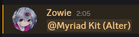

### Other Commands

* `/stats` • show bot statistics
* `/info processes` • detailed bot process stats
* `/info shards` • detailed bot shard stats
